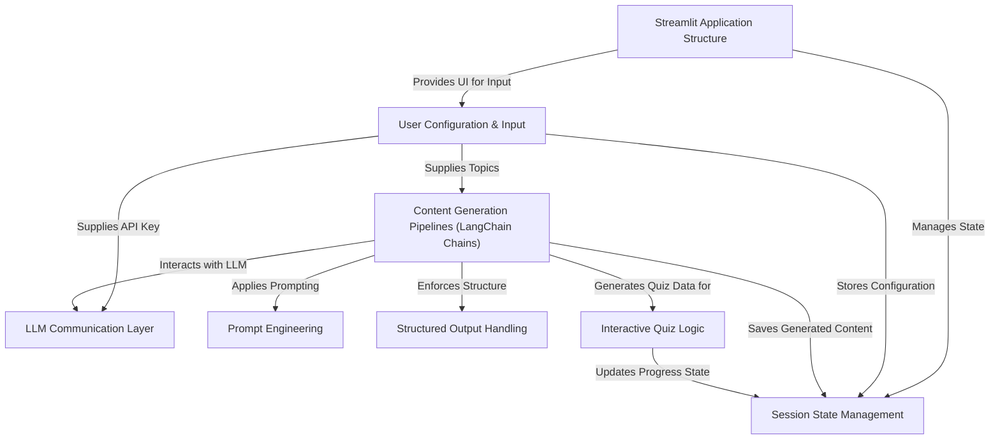

 

[BrainBrew]("https://brain-brew.streamlit.app/") is a Streamlit application that uses **AI** (Large Language Models) to help users learn.
It takes user-provided *topics* and an *API key* to generate **detailed notes**, **question/answer pairs**, and **interactive multiple-choice quizzes**.
The app manages user data and progress using *session state* across different features.

## Visual Overview

## Chapters

1. [Streamlit Application Structure
](tutorial/01_streamlit_application_structure_.md)
2. [User Configuration & Input
](tutorial/02_user_configuration___input_.md)
3. [Session State Management
](tutorial/03_session_state_management_.md)
4. [LLM Communication Layer
](tutorial/04_llm_communication_layer_.md)
5. [Content Generation Pipelines (LangChain Chains)
](tutorial/05_content_generation_pipelines__langchain_chains__.md)
6. [Prompt Engineering
](tutorial/06_prompt_engineering_.md)
7. [Structured Output Handling
](tutorial/07_structured_output_handling_.md)
8. [Interactive Quiz Logic
](tutorial/08_interactive_quiz_logic_.md)

---