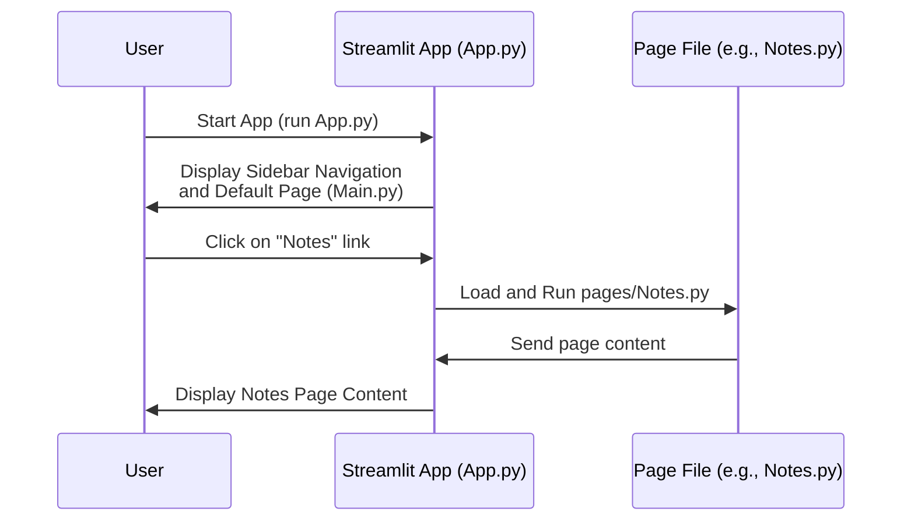

# Chapter 1: Streamlit Application Structure

Welcome to the first chapter of the Brainbrew tutorial! In this chapter, we'll explore the fundamental structure of our web application, powered by the awesome Streamlit library.

Think of building a house. Before you lay a single brick, you need a blueprint. This blueprint defines the rooms, how they connect, and the overall layout. In a web application, we need a similar blueprint to define different sections (like pages for notes, quizzes, etc.) and how users navigate between them.

This is exactly what the **Streamlit Application Structure** does for Brainbrew. It's the core framework that defines:

1.  **The overall layout:** Where the navigation lives, where the main content goes.
2.  **The different 'pages' or 'sections':** Like a dedicated "Notes" page, a "Quiz" page, etc.
3.  **How to move between these pages:** Using a navigation menu, usually in a sidebar.

Let's see how Brainbrew uses this structure to organize its features.

## Organizing Your App with Pages

Streamlit allows you to break down your application into separate files, each representing a different "page" or section. This makes your code much more organized and manageable, just like having separate rooms in a house for different activities.

In Brainbrew, you'll find files like `pages/Notes.py`, `pages/Quiz.py`, `pages/About.py`, and `pages/QnA.py`. Each of these files contains the Streamlit code specifically for that part of the application.

## The Central Hub: `App.py`

Just as the blueprint is the central document for the house, `App.py` is the central file for our Streamlit application. It's the entry point where we tell Streamlit about all the different pages and how users can navigate to them.

In `App.py`, we define each page using `st.Page()`:

```python
# ... (imports and other code)

# Define each page and link it to its file
HomePage = st.Page(
    page="pages/Main.py", # The file containing this page's code
    icon="🔥",
    title = "Get started",
    default = True, # This page is the default when the app starts
)
AboutPage = st.Page(
    page="pages/About.py",
    icon="👤",    
    title = "About"
)

QuizPage = st.Page(
    page="pages/Quiz.py",
    icon="❓",
    title="Quiz"
)

# ... (other page definitions)
```

Here:
*   `st.Page()` creates an object representing a page.
*   `page="pages/Main.py"` tells Streamlit which Python file contains the code for this page.
*   `icon` and `title` are used for display in the navigation menu.
*   `default=True` means this is the first page users see.

We do this for every section we want in our app (Notes, Quiz, Q&A, About).

## Creating Navigation

Once we've defined our pages, we need a way for users to select which page they want to view. Streamlit's `st.navigation()` function does exactly this. It takes a list of the pages we defined and automatically creates a navigation menu, typically displayed in the sidebar.

Look at this snippet from `App.py`:

```python
# ... (page definitions)

# Group the pages together for navigation
pg = st.navigation([HomePage, NotesPage, QnaPage, QuizPage, AboutPage ])

# ... (sidebar setup and page config)

# Run the navigation - this displays the sidebar and the current page
pg.run()
```

By passing our `HomePage`, `NotesPage`, `QnaPage`, `QuizPage`, and `AboutPage` objects to `st.navigation()`, Streamlit automatically builds the sidebar menu that you see when you run the Brainbrew application. Clicking on any item in this sidebar tells Streamlit to load and display the corresponding page file.

Finally, `pg.run()` starts the Streamlit application loop, handles the navigation clicks, and displays the selected page content.

## How It Works (Behind the Scenes)

When you run `App.py`, Streamlit does the following:

1.  It reads `App.py`.
2.  It sees the `st.Page` definitions and knows about the different sections of your app and where to find their code (`pages/` files).
3.  It sees `st.navigation` and builds the sidebar menu based on the titles and icons of the pages you listed.
4.  `pg.run()` starts the app. Streamlit displays the content of the `default` page (`pages/Main.py`).
5.  When a user clicks a link in the sidebar, Streamlit knows which page was clicked (e.g., "Notes").
6.  Streamlit then loads and executes the Python code in the associated page file (`pages/Notes.py`), displaying its output in the main content area of the application.

Here's a simplified flow diagram:



This structure keeps the application organized. `App.py` handles the *where* and *how* of navigation, while the individual files in the `pages/` directory handle the *what* – the specific content and logic for each feature.

## Code Snippets Explained

Let's look at the key code pieces again from `App.py`.

First, defining the pages:

```python
# From App.py
HomePage = st.Page("pages/Main.py", icon="🔥", title = "Get started", default = True)
AboutPage = st.Page("pages/About.py", icon="👤", title = "About")
QuizPage = st.Page("pages/Quiz.py", icon="❓", title="Quiz")
NotesPage = st.Page("pages/Notes.py", icon="📝", title="Notes")
QnaPage = st.Page("pages/QnA.py", icon="🤔", title="Question/Answers")
```
This code block simply tells Streamlit, "Hey, I have these five main sections in my app, and their code lives in these specific files." The icons and titles are what show up in the sidebar.

Next, setting up the navigation:

```python
# From App.py
pg = st.navigation([HomePage, NotesPage, QnaPage, QuizPage, AboutPage ])
# ... other sidebar setup code ...
pg.run()
```
This is where the magic happens. `st.navigation()` takes the list of pages and creates the interactive navigation component. `pg.run()` then makes the app live and manages switching between pages when the user clicks.

Finally, each page file (`pages/*.py`) simply contains the Streamlit code that defines what appears on that specific page. For example, `pages/About.py` contains code to display information about the project creator using `st.markdown` and `st.components.v1.html`:

```python
# From pages/About.py
import streamlit as st
import streamlit.components.v1 as components

# ... CSS styling ...

st.markdown(f"""... HTML for profile picture ...""", unsafe_allow_html=True)
st.markdown("<h1>Sarvamm</h1>", unsafe_allow_html=True)
st.markdown('<p class="subtitle">...</p>', unsafe_allow_html=True)

# ... More content for the About page ...
```
This page file doesn't need to know about the other pages or the navigation; it just focuses on presenting its own content. `App.py` handles displaying this content when the "About" page is selected via the navigation.

## Conclusion

In this chapter, we've learned how Brainbrew is structured using Streamlit's multi-page feature. We saw how `App.py` acts as the central control file, defining the available pages and setting up the navigation sidebar using `st.Page()` and `st.navigation()`. We also understood that the individual files in the `pages/` directory contain the specific content for each section of the app.

This clean structure is essential for building larger applications. Now that we understand the basic layout, we can start looking at how the application interacts with the user and manages information as they use it.

In the next chapter, we'll dive into [User Configuration & Input](02_user_configuration___input_.md), exploring how Brainbrew gets information from the user, like the list of topics and the API key.

[Next Chapter: User Configuration & Input](02_user_configuration___input_.md)

---