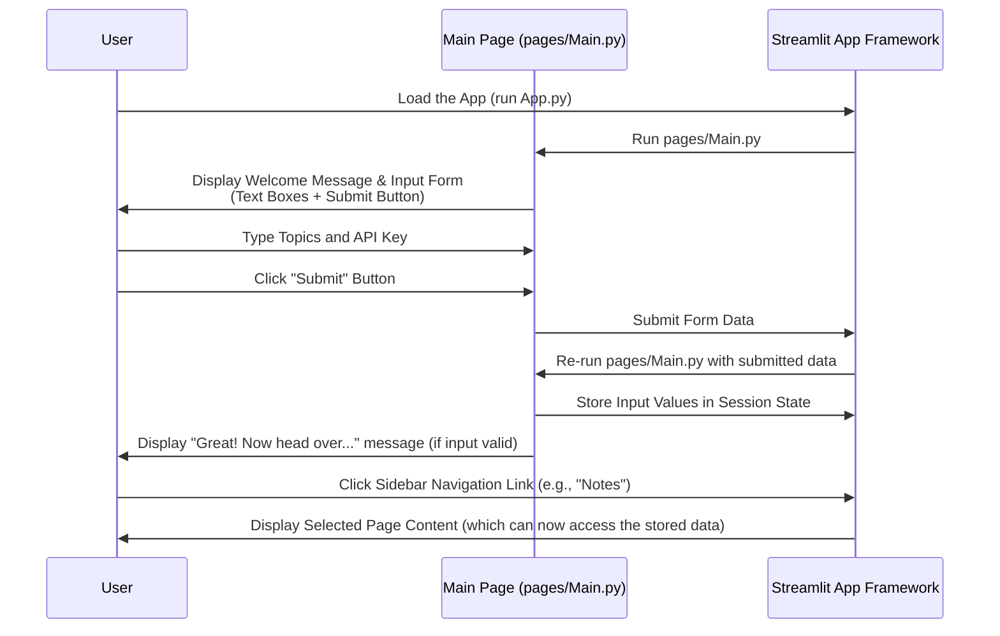

# Chapter 2: User Configuration & Input

Welcome back to the Brainbrew tutorial! In the previous chapter, [Streamlit Application Structure](01_streamlit_application_structure_.md), we built the blueprint for our application, understanding how different pages like "Notes" and "Quiz" are organized and how we navigate between them.

Now that we have the structure, the next crucial step is to get the necessary information from you, the user! Think about starting any application – it often needs some setup. Brainbrew is no different. It needs to know:

1.  **What** you want to learn about.
2.  **How** it can access the AI "brain" to help you learn.

This is where **User Configuration & Input** comes in. It's the part of the application where Brainbrew presents a friendly interface for you to provide this essential information.

## Why Do We Need User Input?

Imagine going to a library and asking for a book, but the librarian doesn't know your name or what subject you're interested in. They can't help you! Similarly, Brainbrew can't generate notes, quizzes, or Q&A pairs without knowing:

*   **Your learning topics:** Are you studying "Quantum Physics," "The French Revolution," or "Python Programming"?
*   **The AI Key:** Brainbrew uses powerful Artificial Intelligence models (specifically Large Language Models or LLMs) to generate content. To access these models, it needs a special "key" (an API key) which is like a password that lets Brainbrew talk to the AI service.

The **User Configuration & Input** phase is all about collecting these pieces of information directly from you at the start.

## How Brainbrew Collects Input

Brainbrew uses Streamlit's built-in components to create interactive elements on the page where you can type things in. The main place this happens is on the starting page of the application (`pages/Main.py`), right after the initial welcome message.

Let's look at the key Streamlit components used:

1.  **`st.text_input()`:** Perfect for getting a single line of text, like an API key.
2.  **`st.text_area()`:** Great for getting longer text, like a list of topics that might take up multiple lines.
3.  **`st.form()` and `st.form_submit_button()`:** These work together to group input elements. When you put `st.text_input()` and `st.text_area()` inside an `st.form()`, the values you type in aren't sent to the app until you click the `st.form_submit_button()`. This is useful because it lets you fill in all the information before the app tries to do anything with it.

## The Input Form in `pages/Main.py`

Now, let's see the code snippet from `pages/Main.py` that creates this input section.

```python
# From pages/Main.py
# ... (previous code for subheader and streamer function) ...

# This creates a form container
with st.form("form"):
    # This creates a text input box for the API key
    st.session_state.groq_api_key = st.text_input("Enter Groq API key here")

    # This creates a text area box for the topics list
    st.session_state.user_input = st.text_area("Start by entering comma separated list of topics here")

    # This creates the submit button for the form
    st.form_submit_button("Submit")

# ... (code that runs AFTER submission) ...
```

Let's break this down line by line:

*   `with st.form("form"):` This line starts a block of code that defines a form. Everything inside this `with` block is part of the form. The `"form"` is just a unique label for this specific form.
*   `st.session_state.groq_api_key = st.text_input("Enter Groq API key here")`: This creates a small box where you can type your Groq API key. The text "Enter Groq API key here" is the label that appears above the box. Notice `st.session_state.groq_api_key = ...`. This is a crucial part we'll discuss in the next chapter, [Session State Management](03_session_state_management_.md), but for now, understand that this line *also* stores whatever you type into a special place called `st.session_state`.
*   `st.session_state.user_input = st.text_area("Start by entering comma separated list of topics here")`: Similar to `st.text_input`, but it creates a larger box (a text area) where you can enter your list of topics. The text "Start by entering..." is the label. Again, `st.session_state.user_input = ...` stores your topics in `st.session_state`.
*   `st.form_submit_button("Submit")`: This line creates the button that says "Submit". When you click this button, Streamlit takes the values from the text boxes inside the form and continues running the code after the `with st.form(...)` block.

## What Happens After Submission?

When you click the "Submit" button:

1.  Streamlit captures whatever you typed into the "Enter Groq API key here" and "Start by entering..." boxes.
2.  These captured values are immediately assigned to `st.session_state.groq_api_key` and `st.session_state.user_input` respectively.
3.  The rest of the script (`pages/Main.py`) continues to run from the line *after* the `st.form` block.

The code snippet below shows what happens right after the form in `pages/Main.py`:

```python
# From pages/Main.py
# ... (st.form block above) ...

# This code runs AFTER the form is submitted
# It checks if BOTH user_input (topics) and groq_api_key have values
if st.session_state.user_input and st.session_state.groq_api_key:
    # If both are present, it displays a message using the streamer function
    st.write_stream(streamer("Great! now head over to the sidebar and start generating!", speed=0.01))
```

This `if` statement checks if you actually provided both the topics (`st.session_state.user_input`) and the API key (`st.session_state.groq_api_key`). If both are present (meaning they are not empty after you clicked submit), it displays a helpful message encouraging you to use the sidebar navigation (which we learned about in [Streamlit Application Structure](01_streamlit_application_structure_.md)) to go to other pages like "Notes" or "Quiz".

*(Note: The `streamer` function is just a little helper in `pages/Main.py` that makes text appear like it's being typed out slowly, character by character. It's a neat visual effect but not central to the input concept itself.)*

## The Flow of User Input

Here's a simplified flow of how the user input works on the main page:



As you can see, the input form on the main page is the first interaction point. It's where you configure the application by telling it what you need. Once you submit, that information becomes available for the rest of the app to use.

## Connecting to the Structure

This input form lives specifically within the `pages/Main.py` file. As we learned in [Streamlit Application Structure](01_streamlit_application_structure_.md), `App.py` defines this as the `HomePage` and sets it as the `default = True` page. This is a logical place to put the initial configuration, as it's the first thing the user sees when they open the application.

The other pages (`pages/Notes.py`, `pages/Quiz.py`, etc.) don't need to ask for this information again because it's collected upfront on the main page. But how do these other pages *access* the topics and API key that were entered on the main page? That's the role of Session State, which is the topic of our next chapter!

## Conclusion

In this chapter, we explored the essential **User Configuration & Input** phase of Brainbrew. We learned why it's necessary to collect information like learning topics and the AI API key. We saw how Streamlit's `st.text_input()`, `st.text_area()`, and `st.form()` components are used in `pages/Main.py` to create an interactive form for you to provide this information.

We also briefly touched upon how the submitted data is stored, which is key for making it available throughout the application. Understanding this input process is the first step in getting Brainbrew ready to generate content for you.

Now that we know how the input is collected, let's dive into how this information is remembered and shared across different parts of the application.

[Next Chapter: Session State Management](03_session_state_management_.md)

---
