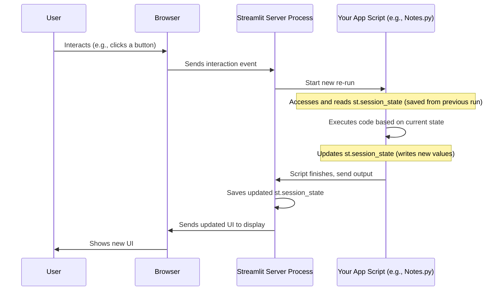

# Chapter 3: Session State Management

Welcome back to the Brainbrew tutorial! In the previous chapter, [User Configuration & Input](02_user_configuration___input_.md), we learned how Brainbrew collects essential information like your learning topics and API key using interactive forms on the main page.

Now, imagine you've entered your topics and API key on the main page and then click on "Notes" in the sidebar. What happens? Streamlit loads the `pages/Notes.py` file and runs its code from top to bottom. But how does the `Notes.py` file know *which* topics you entered on the *previous* page? If Streamlit just runs the script fresh each time, it seems like that information would be lost!

This is where **Session State Management** comes in. It's a fundamental concept in Streamlit that solves this exact problem: how to keep information alive and accessible across different interactions, like clicking buttons, changing inputs, or switching between pages.

## The Problem: Streamlit's "Re-run" Behavior

Streamlit apps work differently than traditional web pages. Every time something happens that could potentially change the display (like you type something, click a button, or select a page in the sidebar), Streamlit re-runs your entire Python script from top to bottom.

Think of it like this: you have a whiteboard, and your Python script is a set of instructions for drawing on it. Every time you interact, someone quickly erases the board and then runs your instructions again to draw the current state of the app. If your instructions only tell it to read the input box *if* it's on the main page, when it re-runs on the Notes page, that instruction isn't executed, and the information seems gone.

This constant re-running is powerful because it makes your app reactive, but it means you need a way to *remember* things that happened in previous re-runs.

## The Solution: `st.session_state`

Streamlit provides a built-in way to remember things: `st.session_state`.

You can think of `st.session_state` as a special dictionary that is preserved *between* these re-runs. It's like having a dedicated, sticky note area on your whiteboard that doesn't get erased when the rest of the board is wiped clean.

You can store any Python object in `st.session_state` – strings, numbers, lists, dictionaries, or even more complex objects.

## How to Use `st.session_state`

Using `st.session_state` is as easy as using a Python dictionary or accessing object attributes.

You can:

1.  **Store a value:** `st.session_state['key_name'] = value` or `st.session_state.key_name = value`
2.  **Retrieve a value:** `my_variable = st.session_state['key_name']` or `my_variable = st.session_state.key_name`
3.  **Check if a key exists:** `if 'key_name' in st.session_state:`

Let's look at how Brainbrew uses this.

## Session State in Brainbrew: Remembering User Input

In [Chapter 2: User Configuration & Input](02_user_configuration___input_.md), we saw this code snippet from `pages/Main.py`:

```python
# From pages/Main.py
# ... (previous code) ...

with st.form("form"):
    # This stores the API key in session state
    st.session_state.groq_api_key = st.text_input("Enter Groq API key here")

    # This stores the topics list in session state
    st.session_state.user_input = st.text_area("Start by entering comma separated list of topics here")

    st.form_submit_button("Submit")

# ... (code that runs AFTER submission) ...
```

When you type into the text boxes and click "Submit", Streamlit updates the values associated with the keys `groq_api_key` and `user_input` within the `st.session_state` dictionary. Because these values are now in `st.session_state`, they will *persist* even when you navigate to another page like "Notes".

## Accessing Session State on Other Pages

Now, when you go to `pages/Notes.py`, the script runs. It needs the topics you entered to generate notes and the API key to talk to the AI model. It accesses this information directly from `st.session_state`:

```python
# From pages/Notes.py
import streamlit as st
from langchain_groq import ChatGroq
# ... (other imports) ...

# Access the API key from session state
qwq = ChatGroq(
    model="qwen-qwq-32b",
    temperature=0.6,
    api_key=st.session_state.groq_api_key, # Using the stored API key
    # ... (other model parameters) ...
)
model = qwq

# ... (prompt template and chain definition) ...

# Check if user_input exists in session state and is not empty
if st.session_state.user_input != "":

    # Check if notes for this input are already in session state
    if st.session_state.notes is None:
        # ... (button to generate notes) ...
            # Generate notes using the topics from session state
            st.session_state.notes = con.write_stream(
                notes_chain.stream({"topics": st.session_state.user_input}), # Using the stored topics
            )
        # ... (display generated notes) ...
    else:
        # ... (display notes from session state if already generated) ...

else:
    # ... (message asking user to enter topics) ...
```

Notice how `pages/Notes.py` simply uses `st.session_state.groq_api_key` and `st.session_state.user_input`. It doesn't need to ask the user for this information again because it retrieves it from the shared `st.session_state` where the main page stored it.

## Session State for Application Progress

Session State isn't just for initial configuration. It's also crucial for tracking progress within a single page or across interactions. The Quiz page (`pages/Quiz.py`) is a great example of this.

When you generate a quiz, the list of questions is generated by the AI. This list needs to be remembered so the user can go through questions one by one. Also, the app needs to remember which question the user is currently on and what their score is. All of this is stored in `st.session_state`:

```python
# From App.py (Initialization)
# These lines are run when the app starts to set default values
if 'quiz_questions' not in st.session_state:
    st.session_state.quiz_questions = None # Store the list of questions
if "current_question_idx" not in st.session_state:
    st.session_state.current_question_idx = 0 # Track current question number
if "score" not in st.session_state:
    st.session_state.score = 0 # Track the user's score
# ... (other session state initializations) ...
```

These initializations in `App.py` ensure these keys exist in `st.session_state` with default values (`None` or `0`) when the application first starts.

Then, in `pages/Quiz.py`:

```python
# From pages/Quiz.py
# ... (imports and model setup) ...

# When the quiz is generated, store the questions in session state
if st.session_state.quiz_questions is None:
    ph = st.empty()
    if ph.button("Generate Quiz"):
        ph.empty()
        # The result of quiz_chain.invoke is stored here
        st.session_state.quiz_questions = quiz_chain.invoke(
                {"topic": st.session_state.user_input} # Uses topics from session state
        )
        st.success("Quiz generated!")
        quiz() # Calls the quiz function
# ... (rest of quiz generation logic) ...

def quiz():
    # Access questions and progress from session state
    questions = st.session_state.quiz_questions
    total_questions = len(questions)

    # Update progress display using session state
    st.progress(len(st.session_state.attempted_questions) / total_questions)
    st.write(
        f"Questions attempted: {len(st.session_state.attempted_questions)}/{total_questions}"
    )

    # Check current question index from session state
    if st.session_state.current_question_idx < total_questions:
        current_question = questions[st.session_state.current_question_idx]
        # ... (display current question and options) ...

        if st.button("Next Question"):
            # Update score and index in session state
            if options[answer]:
                st.session_state.score += 1
            st.session_state.attempted_questions.add(
                st.session_state.current_question_idx
            )
            st.session_state.current_question_idx += 1
            st.rerun() # Rerun the script to show the next question

    # Check if quiz is complete using session state
    if st.session_state.current_question_idx >= total_questions:
        st.session_state.quiz_completed = True
        st.rerun()

    # Display end screen using score from session state
    if st.session_state.quiz_completed:
        st.header("Quiz Complete! 🎉", divider=True)
        # ... (display score using st.session_state.score) ...

# ... (call quiz function if questions exist in session state) ...
```

Every time you click "Next Question", the `pages/Quiz.py` script re-runs. But thanks to `st.session_state`, it remembers:
*   The full list of `quiz_questions`.
*   Which question is next (`current_question_idx`).
*   Your current `score`.
*   Which questions you've `attempted_questions`.
*   Whether the `quiz_completed` state is true or false.

Without `st.session_state`, the quiz would reset to the first question with a score of 0 every time you clicked "Next"!

## How Session State Works (Simplified)

When a Streamlit app is running, there's a background process managing the user's session. This session lasts as long as the user has the browser tab open. The `st.session_state` dictionary is stored and maintained by this background process for that specific user session.

When a re-run happens:
1.  Streamlit receives the event (like a button click or page change).
2.  It prepares to re-run the script.
3.  Crucially, it *loads the current state* of `st.session_state` that it had saved from the end of the *previous* re-run.
4.  The script starts running from the top. Any code that accesses `st.session_state` gets the values that were saved.
5.  Any code that *assigns* to `st.session_state` updates the dictionary.
6.  When the script finishes, Streamlit *saves* the updated `st.session_state` for the next re-run.

Here's a simplified sequence:



This cycle allows the app to maintain context and remember crucial data across interactions.

## Initializing Session State (Why `if 'key' not in st.session_state:`)

You might have noticed lines like this in `App.py`:

```python
# From App.py
if "user_input" not in st.session_state:
    st.session_state.user_input = None

if 'quiz_questions' not in st.session_state:
    st.session_state.quiz_questions = None
# ... (and so on for other variables)
```

These lines are important for the *very first* time the script runs in a new user session. When a user first opens the app, `st.session_state` is completely empty. If your script tries to access `st.session_state.user_input` before anything has been stored there, it will cause an error.

By checking `if "user_input" not in st.session_state:`, we ensure that if this is the first run and `user_input` hasn't been set yet, we give it a default value (`None` in this case). This prevents errors later in the script when we try to read `st.session_state.user_input` on a page like Notes or Quiz, even if the user hasn't submitted the form on the main page yet.

It's good practice to initialize all the session state variables your app relies on at the beginning of your main app script (`App.py` is a common place for this) to give them default values.

## Conclusion

**Session State Management** is the backbone of creating interactive Streamlit applications like Brainbrew that can remember things. We learned that because Streamlit re-runs the script on every interaction, we need `st.session_state` – a persistent, session-specific dictionary – to store data like user input, API keys, generated content, and application progress (like quiz scores).

We saw how data entered on the main page is stored in `st.session_state` and then accessed by other pages like Notes and Quiz. We also saw how the Quiz page uses session state extensively to keep track of questions and the user's progress across multiple button clicks.

Now that we understand how Brainbrew remembers information, we're ready to explore how it uses this information to interact with the powerful AI models.

[Next Chapter: LLM Communication Layer](04_llm_communication_layer_.md)

---