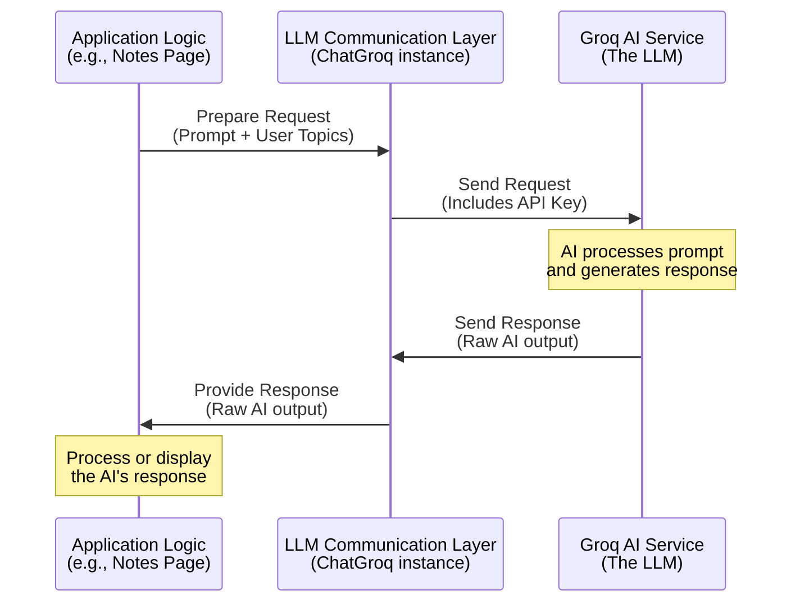

# Chapter 4: LLM Communication Layer

Welcome back to the Brainbrew tutorial! In the previous chapter, [Session State Management](03_session_state_management_.md), we learned how Brainbrew uses Streamlit's `st.session_state` to remember important information across different interactions and pages, like the topics you want to learn about and your API key.

Now that the application remembers *what* you want to do and *how* it can access the AI, the next crucial step is actually *talking* to that AI. This is where the **LLM Communication Layer** comes in.

## What is the LLM Communication Layer?

Imagine Brainbrew is a user in a library who needs help from a super-expert librarian (the Large Language Model, or LLM). The user (your application) has a question (your request) and knows the librarian's special code (the API key). But the user doesn't speak the librarian's language perfectly, and the librarian has a specific way they like to receive questions and give answers.

The **LLM Communication Layer** is like a dedicated translator and messenger service in the middle. It takes the request from the Brainbrew application, translates it into the format the AI librarian understands, uses the special code (API key) to connect to the librarian's desk (the AI service), delivers the request, waits for the response, and then brings the response back to the Brainbrew application, translating it back if necessary.

In the context of Brainbrew, the LLM Communication Layer is the part of the code responsible for:

1.  Knowing *how* to connect to the specific AI service (Groq, in our case).
2.  Using the provided API key to authenticate the connection.
3.  Sending the application's requests (which are based on your topics and prompts) to the AI model.
4.  Receiving the raw response from the AI model.
5.  Passing that response back to other parts of the application for further processing or display.

It's the essential bridge that connects Brainbrew's logic and user interface to the powerful generative capabilities of the AI backend.

## Connecting to the AI: The API Key

As you saw in [Chapter 2: User Configuration & Input](02_user_configuration___input_.md) and [Chapter 3: Session State Management](03_session_state_management_.md), the first piece of information Brainbrew needs is your Groq API key. This key is like a password or a ticket that grants Brainbrew permission to use the Groq AI service. Without it, Brainbrew can't talk to the AI.

When you enter your API key on the main page and click submit, it's stored safely in `st.session_state`. The LLM Communication Layer retrieves this key from `st.session_state` whenever it needs to initiate a connection or send a request to the AI.

## Using `langchain_groq` to Talk to Groq

Brainbrew uses a popular library called `LangChain` to make interacting with LLMs easier. Specifically, it uses a component designed for the Groq service, found in the `langchain_groq` package.

The main tool from this package that acts as our "messenger" is the `ChatGroq` class.

You can see this in files like `pages/Notes.py`, `pages/QnA.py`, and `pages/Quiz.py`. At the beginning of these files, after the imports, you'll find code similar to this:

```python
# From pages/Notes.py (simplified)
from langchain_groq import ChatGroq
import streamlit as st # Needed to access session_state

# This line initializes the connection object
qwq = ChatGroq(
    model="qwen-qwq-32b", # Specifies which Groq model to use
    temperature=0.6,      # Controls randomness of output
    api_key=st.session_state.groq_api_key, # Retrieves the API key from session state
)

# Often a variable 'model' is set to this object for easy use
model = qwq
```

Let's break this simple code down:

*   `from langchain_groq import ChatGroq`: This line imports the necessary class from the `langchain_groq` library.
*   `qwq = ChatGroq(...)`: This creates an *instance* of the `ChatGroq` class. Think of this `qwq` object as the specific messenger service that is ready to talk to Groq.
*   `model="qwen-qwq-32b"`: This parameter tells the messenger *which* specific AI model from the Groq service it should communicate with. Groq offers several models, and "qwen-qwq-32b" is chosen here.
*   `temperature=0.6`: This parameter influences the creativity or randomness of the AI's response. A lower temperature (closer to 0) makes the output more predictable and focused, while a higher temperature makes it more varied.
*   `api_key=st.session_state.groq_api_key`: **This is the crucial part for the communication layer.** It takes the API key that you entered on the main page (and that was stored in `st.session_state`) and provides it to the `ChatGroq` object. This object will use this key internally to authenticate its requests to the Groq service.
*   `model = qwq`: This line simply assigns the created `ChatGroq` object to a variable named `model`. This is a common convention, and you'll see this `model` variable used later when the application is ready to send a request.

Every page that needs to talk to the AI (like Notes, Q&A, and Quiz) will have this initialization code at the beginning to set up its messenger service (`model`) using the API key from session state.

## Sending Requests and Receiving Responses

Once the `model` object (our `ChatGroq` instance) is initialized, it's ready to send requests. The requests themselves are essentially the instructions or questions we want the AI to answer, often formatted as "prompts" (which we'll cover in [Chapter 6: Prompt Engineering](06_prompt_engineering_.md)) and including the user's specific topics (from `st.session_state.user_input`).

The LLM Communication Layer, represented by the `model` object, takes this formatted request and handles the technical details of sending it over the internet to the Groq servers. It waits for the AI to process the request and generate a response.

Once the response arrives back from the Groq service, the `model` object receives the raw AI output (usually text). It then provides this output back to the part of the Brainbrew application that initiated the request.

## The Flow of Communication

Here's a simplified look at how a request travels from the application logic through the LLM Communication Layer to the AI and back:



As you can see, the LLM Communication Layer sits between the core application logic (which decides *what* to ask) and the external AI service. Its job is purely to handle the connection, authentication, sending, and receiving of the message.

## The `model` Object in Action

In later chapters, particularly [Chapter 5: Content Generation Pipelines (LangChain Chains)](05_content_generation_pipelines__langchain_chains__.md), you'll see how the `model` object is integrated into larger processing steps (called "chains"). However, at its core, sending a simple message using the `model` object looks something like this (though Brainbrew uses chains for more complex interactions):

```python
# Very simplified example - not exactly how Brainbrew does it,
# but shows the model's basic function
import streamlit as st
from langchain_groq import ChatGroq

# Assume model is initialized as shown before
model = ChatGroq(
    model="qwen-qwq-32b",
    temperature=0.6,
    api_key=st.session_state.groq_api_key,
)

# Prepare a simple message
message_to_send = "What is the capital of France?"

# Send the message and get the response
# In LangChain, this is often done via 'invoke' or 'stream' methods
# Let's simulate getting a response:
ai_response_object = model.invoke(message_to_send) # This sends the request!

# The actual text response is usually accessed from the object
raw_ai_output = ai_response_object.content

# raw_ai_output would now be something like "Paris"

st.write("AI says:", raw_ai_output)

```
This simple example demonstrates that the `model` object, once initialized with the API key, is the method through which the application sends its question (`message_to_send`) and receives the AI's answer (`raw_ai_output`). The LLM Communication Layer handles all the complexity of the network request and talking to the Groq API behind the scenes.

In Brainbrew's actual code (like in `pages/Notes.py` or `pages/Quiz.py`), you'll see the `model` object connected within LangChain "chains" (e.g., `notes_chain = notes_prompt | model | output_parser`). This piping (`|`) indicates that the output of the `notes_prompt` step goes *into* the `model` step (sending the request to the AI), and the output of the `model` step (the AI's response) goes into the `output_parser` step. The `model` object is the crucial piece in that pipeline that makes the external AI call.

## Conclusion

In this chapter, we explored the **LLM Communication Layer**, which is the bridge between the Brainbrew application and the powerful Groq AI service. We learned that it handles the technical details of connecting to the AI using your API key (retrieved from [Session State Management](03_session_state_management_.md)) and sending/receiving messages.

We saw that the `ChatGroq` class from the `langchain_groq` library is the key component used to establish this connection and perform the communication. Initializing this class with the API key creates the `model` object that the rest of the application uses to interact with the AI.

Now that we understand *how* Brainbrew talks to the AI, we're ready to look at *what* it says to the AI and *how* it processes the AI's response to generate useful content like notes or quizzes.

[Next Chapter: Content Generation Pipelines (LangChain Chains)](05_content_generation_pipelines__langchain_chains__.md)

---