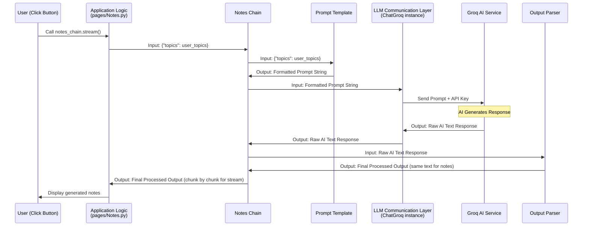

# Chapter 5: Content Generation Pipelines (LangChain Chains)

Welcome back to the Brainbrew tutorial! In the last chapter, [LLM Communication Layer](04_llm_communication_layer_.md), we learned how Brainbrew uses the `ChatGroq` object from LangChain to connect to the Groq AI service and send requests. We saw that the `model` variable acts like our messenger, ready to talk to the AI using your API key (which we stored using [Session State Management](03_session_state_management_.md)).

Now, simply *talking* to the AI isn't enough. We don't just send raw user input like "Physics topics" and expect perfect notes back. Generating useful content like comprehensive notes or structured quiz questions requires a few steps:

1.  **Formatting the Request:** We need to package the user's input ("Physics topics") into a clear instruction for the AI (like "Act as a college professor and generate notes on these topics...").
2.  **Sending to the AI:** We use our messenger (`model`) to send this formatted request to Groq.
3.  **Getting the Raw Response:** The AI sends back its answer, usually as a block of text.
4.  **Processing the Response:** We might need to clean up the AI's text, extract specific pieces of information, or convert it into a specific format (like a list of questions).

Doing these steps individually every time would be repetitive. This is where **Content Generation Pipelines**, specifically implemented using **LangChain Chains**, come in.

## What are LangChain Chains?

Think of a LangChain Chain as a small, automated assembly line designed for generating a specific type of content. Each station on the assembly line performs one step: preparing the input, processing it with the AI, and then handling the output.

Instead of manually doing steps 1, 2, 3, and 4 every time you want notes or a quiz, you build a chain *once* for notes, and another chain for quizzes. Then, you just give the chain the raw input (the topics), and it automatically runs it through all the necessary steps to produce the final, desired output (formatted notes, a list of quiz questions, etc.).

It connects different components together in a sequence, making your code cleaner and the content generation process repeatable.

## Building Blocks of a Simple Chain

A basic LangChain chain for content generation typically involves connecting three main types of components:

1.  **Prompt Template:** This component takes your raw input (like the topics) and fills it into a predefined instruction template for the AI. It formats *what* you ask the AI. (We'll dive deeper into this in [Chapter 6: Prompt Engineering](06_prompt_engineering_.md)).
2.  **Language Model (LLM):** This is where our `model` object (the `ChatGroq` instance) from [Chapter 4: LLM Communication Layer](04_llm_communication_layer_.md) comes in. It takes the formatted prompt, sends it to the AI, and gets the raw text response back. This is the step that actually *generates* the content.
3.  **Output Parser:** This component takes the raw text output from the LLM and processes it into a more usable format. For simple notes, it might just pass the text through, but for structured data like quizzes or Q&A, it's essential for extracting information. (We'll look at this more in [Chapter 7: Structured Output Handling](07_structured_output_handling_.md)).

## Connecting the Blocks: The Pipe (`|`) Operator

LangChain uses a special operator, the pipe symbol `|`, to connect components together in a chain. It works just like pipes in a command line: the output of the component on the left becomes the input for the component on the right.

`ComponentA | ComponentB | ComponentC`

This means:
1.  Input goes into `ComponentA`.
2.  The output of `ComponentA` goes into `ComponentB`.
3.  The output of `ComponentB` goes into `ComponentC`.
4.  The output of `ComponentC` is the final result of the chain.

## Example: The Notes Generation Chain

Let's look at the code in `pages/Notes.py` to see how the notes generation chain is built.

First, we define the Prompt Template:

```python
# From pages/Notes.py
from langchain_core.prompts import PromptTemplate

# ... (model initialization from Chapter 4) ...

NOTES_PROMPT_TEMPLATE = r"""
You are a professional college professor. Generate comprehensive notes based on these topics:
{topics}

# ... (formatting instructions like markdown, latex etc) ...
    """

# Create a PromptTemplate object from the string
notes_prompt = PromptTemplate.from_template(NOTES_PROMPT_TEMPLATE)
```

This code block defines the text template for the prompt. The `{topics}` part is a placeholder where the user's actual list of topics will be inserted. `PromptTemplate.from_template()` creates a component that's ready to take the topics and format the full prompt string.

Next, we have our Language Model component (the `model`):

```python
# From pages/Notes.py
from langchain_groq import ChatGroq
import streamlit as st # Needed to access session_state

# ... (imports for prompt template, parser) ...

# Initialize the model from Chapter 4
qwq = ChatGroq(
    model="qwen-qwq-32b",
    temperature=0.6,
    api_key=st.session_state.groq_api_key, # Uses API key from session state
    # ... (other model parameters) ...
)
model = qwq # Our LLM component
```

This code initializes the connection to the AI, as we saw in [Chapter 4: LLM Communication Layer](04_llm_communication_layer_.md). This `model` object is the component that will send the request and get the response.

Then, we have the Output Parser:

```python
# From pages/Notes.py
from langchain_core.output_parsers import StrOutputParser

# ... (imports for prompt template, model) ...

# Create a simple output parser
output_parser = StrOutputParser()
```

`StrOutputParser` is the simplest parser. It just takes the raw string output from the LLM and passes it through as the final output. For notes, this is often sufficient.

Finally, we connect them using the pipe operator to create the `notes_chain`:

```python
# From pages/Notes.py
# ... (prompt, model, parser definitions above) ...

# Connect the components into a chain!
notes_chain = notes_prompt | model | output_parser
```

This single line creates the entire workflow:
1.  Input (the user's topics) goes into `notes_prompt`.
2.  The formatted prompt string from `notes_prompt` is sent to `model`.
3.  The raw text response from `model` is sent to `output_parser`.
4.  The processed output (the raw text itself, in this case) from `output_parser` is the final result of calling `notes_chain`.

## Using the Chain

Once the chain is built, you can use it by calling its `.invoke()` or `.stream()` method. The `invoke` method runs the chain once and returns the final result, while `stream` returns the result piece by piece as it's generated (useful for displaying content as it arrives from the AI, like the typing effect in Brainbrew).

In `pages/Notes.py`, when you click the "Generate Notes" button, the code uses the `notes_chain` like this:

```python
# From pages/Notes.py
# ... (chain definition above) ...

if st.session_state.user_input != "":
    if st.session_state.notes is None:
        ph = st.empty()
        if ph.button("Generate Notes"):
            ph.empty()
            con = st.container(border=True)

            # Use the chain to generate notes!
            st.session_state.notes = con.write_stream(
                notes_chain.stream({"topics": st.session_state.user_input}), # Provide topics as input
            )
            # ... (display logic) ...
```

Notice `notes_chain.stream({"topics": st.session_state.user_input})`. We are calling the `stream` method of our `notes_chain`. We provide the user's topics (retrieved from `st.session_state` as discussed in [Session State Management](03_session_state_management_.md)) in a dictionary because the `NOTES_PROMPT_TEMPLATE` expects an input variable named `topics`. The output of the chain (the generated notes) is then stored back into `st.session_state.notes` so it persists across re-runs.

## How the Chain Runs (Behind the Scenes)

When you call `notes_chain.stream({"topics": user_topics})`, here's a simplified flow of what happens:



This sequence shows how the input `user_topics` flows through each component connected by the `|` operator, transforming step-by-step until the final output is ready.

## Other Chains in Brainbrew

Brainbrew uses similar chain structures for other content types as well:

*   **Q&A Generation (`pages/QnA.py`):** Has a `questions_chain` and an `answer_chain`. These chains are a bit more complex and involve "structured output" (asking the AI to respond in a specific format like a list or JSON) which we'll cover in [Chapter 7: Structured Output Handling](07_structured_output_handling_.md). But they still follow the `prompt | model | parser` pattern.
*   **Quiz Generation (`pages/Quiz.py`):** Has a `quiz_chain` that is designed to generate questions and multiple-choice options in a structured format, also using structured output techniques.

The core concept remains the same: define the steps (prompt, model, parser), connect them with `|`, and then invoke the chain with the user's input to get the desired content.

## Conclusion

In this chapter, we learned about **Content Generation Pipelines** using **LangChain Chains**. We saw that chains are like automated workflows that combine a **Prompt Template** (to format the request), a **Language Model** (the AI messenger from [LLM Communication Layer](04_llm_communication_layer_.md) that talks to Groq), and an **Output Parser** (to process the AI's response).

We explored how the pipe operator (`|`) connects these components sequentially and looked at the `notes_chain` in `pages/Notes.py` as a concrete example. We also saw how invoking the chain with user input triggers this workflow and produces the final content, which is then stored using [Session State Management](03_session_state_management_.md).

Chains are a powerful way to structure complex interactions with LLMs into clear, reusable pipelines. Now that we understand the pipeline structure, let's zoom in on the crucial first step: crafting the instructions we give to the AI.

[Next Chapter: Prompt Engineering](06_prompt_engineering_.md)

---