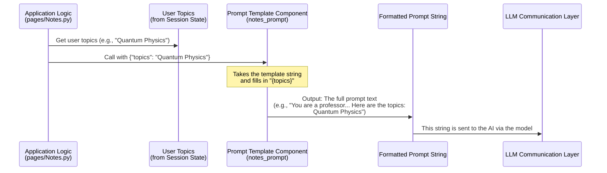

# Chapter 6: Prompt Engineering

Welcome back to the Brainbrew tutorial! In the previous chapter, [Content Generation Pipelines (LangChain Chains)](05_content_generation_pipelines__langchain_chains__.md), we learned how to build automated workflows (chains) that connect different components like a Prompt Template, a Language Model (the AI), and an Output Parser.

The chain is the assembly line, and the AI is the worker on that line doing the heavy lifting of generating text. But for the worker to do exactly what you want, you need to give them very clear instructions!

Imagine you're asking a brilliant but slightly literal chef (the AI) to make a dish. If you just say "Make pasta," you might get anything from plain boiled spaghetti to a gourmet lasagna. To get *your* specific favorite dish, you need a detailed recipe: "Make carbonara pasta. Use pancetta, not bacon. Make sure the sauce is creamy but doesn't curdle. Use fresh parmesan..."

In the world of AI, giving these detailed instructions is called **Prompt Engineering**.

## What is Prompt Engineering?

**Prompt Engineering** is the practice of designing and refining the specific text instructions (called **prompts**) that you send to an AI model. It's about carefully crafting your request to tell the AI:

*   **What task to perform:** Generate notes, answer a question, write a quiz.
*   **What persona to adopt:** Act like a college professor, a friendly tutor, etc.
*   **What information to use:** The topics you provided.
*   **What format to follow:** Use Markdown, provide a list, return JSON, include LaTeX.
*   **What style or tone to use:** Comprehensive, simple, formal, informal.

Think of the prompt as the **recipe** you give to the AI chef. A good recipe (prompt) leads to the desired dish (output).

## Why is Prompt Engineering Important in Brainbrew?

Brainbrew needs the AI to generate very specific types of content for learning:

*   **Notes:** Needs to be comprehensive, well-structured Markdown, potentially including math formatting.
*   **Quiz Questions:** Needs to be multiple-choice, with correct answers marked, and in a format the app can easily read (like JSON).
*   **Q&A:** Needs clear questions and detailed answers.

If we just sent the AI the raw topics, it wouldn't know whether to write an essay, generate flashcards, or create a song about them. Prompt Engineering is how we guide the AI to produce the exact **format, style, and type** of content useful for learning.

## Key Elements of a Good Prompt

A good prompt for an AI often includes several key elements to give the AI clear guidance:

| Element        | What it tells the AI                        | Example (for Notes)           |
| :------------- | :------------------------------------------ | :---------------------------- |
| **Role**       | Who should the AI pretend to be?            | "You are a college professor." |
| **Task**       | What should the AI do?                      | "Generate comprehensive notes." |
| **Context**    | What information should the AI use?         | "Based on these topics: {topics}" |
| **Format**     | How should the output be structured?        | "Use proper markdown formatting.", "Use $...$ for LaTeX." |
| **Constraints**| Any specific rules or limitations?          | "Do not forget dollar signs." |
| **Examples**   | Show the AI the desired output format (very helpful for complex structures like JSON). | (Shown in Quiz prompt) |

By including these elements, you dramatically increase the chance of the AI returning exactly what you need.

## Prompt Templates in Brainbrew

In Brainbrew, we use **Prompt Templates** (from LangChain, as seen in [Content Generation Pipelines (LangChain Chains)](05_content_generation_pipelines__langchain_chains__.md)) to build our prompts. A template is just a string with placeholders for the parts that change, like the user's topics.

Let's look at the `NOTES_PROMPT_TEMPLATE` from `pages/Notes.py`:

```python
# From pages/Notes.py
# ... (imports and model setup) ...

NOTES_PROMPT_TEMPLATE = r"""
You are a professional college professor. Generate a set of comprehensive notes based on the topic provided.
The notes should be detailed, well-structured, and easy to understand. 
Use $...$ to wrap *every* mathematical expression, including equations, formulas, or symbols.
The notes should be suitable for students in their final year of high school or the first year of university.
Use proper markdown formatting where necessary. Use headers, subheader, dividers etc. 
For math or physics related topics, use Latex in inline markdown using the $ symbol. For example: $E=mc^2$.
Wrap full LaTeX blocks like matrices in $$...$$.
Example: $$A = \begin{{bmatrix}} 1 & 2 \\ 3 & 4 \end{{bmatrix}}$$
Wrap inline formulas like $a_{{ij}}$ or $x^2 + y^2 = z^2$.
Do not forget to include both dollar signs.

Here are the topics:
{topics}
    """

# Create a PromptTemplate object from the string
notes_prompt = PromptTemplate.from_template(NOTES_PROMPT_TEMPLATE)

# ... (rest of the chain) ...
```

Let's break down how this template uses the prompt engineering elements:

*   `You are a professional college professor.` - This sets the **Role**. It tells the AI to adopt an authoritative, knowledgeable tone suitable for academic notes.
*   `Generate a set of comprehensive notes based on the topic provided.` - This is the main **Task**.
*   `The notes should be detailed, well-structured, and easy to understand.` and `The notes should be suitable for students...` - These provide **Constraints** and define the desired **Style/Tone** and audience.
*   `Use proper markdown formatting... Use headers, subheader, dividers etc.` - This specifies the required **Format**.
*   `Use $...$ to wrap *every* mathematical expression... For math or physics related topics, use Latex...` - This provides very specific **Formatting** instructions for technical content.
*   `Example: $$A = \begin{{bmatrix}} 1 & 2 \\ 3 & 4 \end{{bmatrix}}$$` - This gives a clear **Example** of the desired LaTeX formatting.
*   `Here are the topics:\n{topics}` - This introduces the **Context** section and shows where the `{topics}` placeholder for the user's input will go.

By combining these elements, the `notes_prompt` is much more likely to produce useful, formatted notes compared to just sending the AI "Write about Physics topics."

The `PromptTemplate.from_template(NOTES_PROMPT_TEMPLATE)` line simply converts this multi-line string into a `PromptTemplate` object that LangChain can use within a chain.

## Prompt Engineering for Different Tasks

Let's quickly look at the start of the prompt templates for other tasks to see how they differ based on the required output:

**Q&A Questions Prompt (`pages/QnA.py`):**

```python
# From pages/QnA.py
# ... (imports and model setup) ...

QUESTIONS_PROMPT_TEMPLATE = r"""
You are a professional college professor. And you are creating a test paper.
Generate a set of questions that challenge the students' understanding of the given topic.
# ... (LaTeX formatting instructions similar to Notes) ...
wrap response questions in list of strings, wrap each question in triple quotes.
Respond only with a list of questions of the format:
[["Question1", "Question2", "Question3"]]

Here are the topics:
{topics}
"""
questions_prompt = PromptTemplate.from_template(QUESTIONS_PROMPT_TEMPLATE)
# ... (rest of the chain) ...
```

Here, the **Task** changes ("Generate questions"), the **Role** is refined ("creating a test paper"), and importantly, the **Format** instructions are very specific ("wrap response questions in list of strings... Respond only with a list of questions of the format: [["Question1", "Question2", "Question3"]]"). This tells the AI exactly how the output should be structured so the application can easily process it.

**Quiz Questions Prompt (`pages/Quiz.py`):**

```python
# From pages/Quiz.py
# ... (imports and model setup) ...

QUIZ_PROMPT_TEMPLATE = r"""
You are a college professor tasked with creating a multiple choice question (MCQs) quiz on these topics:
{topic}
Generate at least 10 MCQs.
The output should be json formatted  like this:


[[
  {{
    "question": "If a train travels 120 miles in 2 hours, what is its average speed?",

    "options": {{
      "60 mph": true, #true if the option is correct false otherwise
      "40 mph": false,
      "100 mph": false,
      "240 mph": false
    }}
  }},
  
  and so on..
  
]]
"""
quiz_prompt = PromptTemplate.from_template(QUIZ_PROMPT_TEMPLATE)
# ... (rest of the chain) ...
```

Again, the **Task** is different ("creating a multiple choice question... quiz"). The **Format** is the most critical part here, specifying that the output *must* be JSON and providing a clear **Example** of the exact structure required, including how to mark the correct answer (`true`/`false`). This kind of detailed formatting instruction and example is vital for structured output, which we'll cover next.

## How Prompt Engineering Works in the Chain

As we saw in [Content Generation Pipelines (LangChain Chains)](05_content_generation_pipelines__langchain_chains__.md), the `PromptTemplate` is the first step in our chains:

`notes_chain = notes_prompt | model | output_parser`

Here's a simplified flow focused on the prompt step:



The `PromptTemplate` component's job is simply to take the template you defined and the specific input for that run (the user's topics for *this* generation request) and combine them into the final string that gets sent to the AI model. This ensures that every request to the AI includes all the necessary instructions (role, task, format, etc.) along with the dynamic user input.

## Conclusion

**Prompt Engineering** is the art and science of crafting effective instructions for AI models. It's how we tell the AI exactly what kind of content to generate, in what style and format, and using the relevant information. In Brainbrew, we use **Prompt Templates** within our LangChain Chains to incorporate well-engineered prompts for generating notes, Q&A, and quizzes.

We saw how elements like Role, Task, Context, and Format instructions are included in the prompt templates in files like `pages/Notes.py`, `pages/QnA.py`, and `pages/Quiz.py` to guide the AI's generation process.

While good prompts are essential, AI models can sometimes still deviate from complex formatting instructions, especially for structured data like lists or JSON. In the next chapter, we'll look at how Brainbrew handles this challenge using **Structured Output Handling** to ensure the AI's response can be reliably processed by the application.

[Next Chapter: Structured Output Handling](07_structured_output_handling_.md)

---