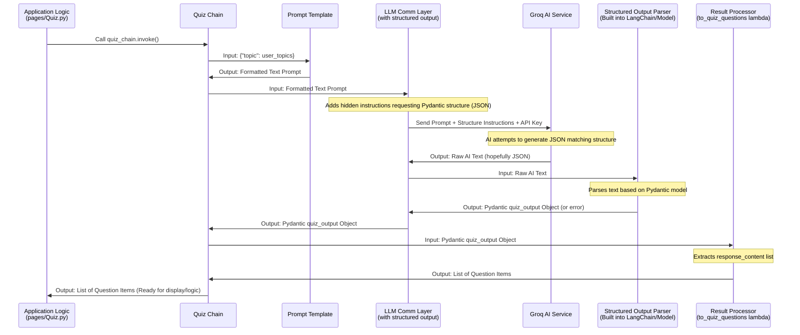

# Chapter 7: Structured Output Handling

Welcome back to the Brainbrew tutorial! In the previous chapter, [Prompt Engineering](06_prompt_engineering_.md), we learned how to craft detailed instructions for the AI using Prompt Templates to guide it in generating content. We saw how important it is to specify the role, task, and desired format in the prompt.

However, even with a great prompt, getting the AI to consistently produce output in a very rigid, structured format (like a list of questions where each question has specific options marked as correct or incorrect) can be tricky. AI models are designed to generate human-readable text, which is flexible. When we need the output to be machine-readable – something our application can easily parse and use programmatically – we need more than just text instructions.

Imagine asking the AI to generate a quiz. You don't just want a block of text that *looks* like a quiz. You need a list of distinct questions, each with its options clearly separated, and a definitive mark indicating which option is the correct one. Trying to extract this specific data from a free-form text paragraph would be very difficult and error-prone.

This is where **Structured Output Handling** comes in. It's a powerful mechanism that goes beyond simple text prompts to tell the AI framework (like LangChain talking to Groq) that we expect the response to conform to a precise data structure. It's like giving the AI a specific form to fill out, rather than just asking it to write an essay about the topic.

## Why Structured Output is Crucial

For Brainbrew to build an interactive quiz or parse Q&A pairs reliably, it needs the AI's output in a format it understands programmatically. This means not just human-readable text, but data structured as:

*   A list of items.
*   Each item having specific fields (e.g., a "question" field, an "options" field).
*   The "options" field being something like a list or dictionary with each option clearly labeled and its correctness indicated.

Structured Output Handling ensures that the AI framework attempts to guide the LLM to produce this structure and provides tools to parse the result reliably into Python objects that your application code can easily work with.

## Defining the Structure: Using Pydantic

How do we tell the AI *exactly* what structure we need? In Brainbrew, and commonly in the Python world, we use libraries like **Pydantic** to define data structures. Pydantic lets you define Python classes that act like blueprints for data, specifying the expected field names and their data types (like string, integer, list, dictionary, boolean).

Let's look at the `pages/Quiz.py` file. At the beginning, you'll find the definition of the expected output structure for the quiz using Pydantic:

```python
# From pages/Quiz.py
from pydantic import Field, BaseModel
from typing import Dict # Used for dictionary type hint

# This defines the overall structure we expect for the quiz output
class quiz_output(BaseModel):
    """Response to the prompt in the following format only"""

    # This defines the structure for a single question item
    class QuestionItem(BaseModel):
        question: str = Field(description="Question to be asked")
        options: Dict[str, bool] = Field(
            description="A dictionary with string options each pointing to a bool, True if the option is correct and false otherwise"
        )

    # These are fields for the overall output (useful for debugging/AI thought process)
    thinking_content: str = Field(description="All the reasoning/thinking content here")
    response_content: list[QuestionItem] = Field(
        description="A list containing questions items"
    )
```

Let's break this down:

*   `from pydantic import Field, BaseModel`: Imports the necessary tools from Pydantic. `BaseModel` is the base class for creating your data blueprints. `Field` is used to add extra information (like a description) to a field.
*   `class quiz_output(BaseModel):`: We define a Pydantic model named `quiz_output`. This is the top-level structure we expect back from the AI.
*   `class QuestionItem(BaseModel):`: Inside `quiz_output`, we define another Pydantic model, `QuestionItem`. This defines the structure for *each individual question* within the quiz. It's nested because `quiz_output` will contain a *list* of these `QuestionItem` objects.
*   `question: str = Field(...)`: Inside `QuestionItem`, this line defines a field named `question` which must be a string (`str`). The `Field` part adds a human-readable description.
*   `options: Dict[str, bool] = Field(...)`: Also inside `QuestionItem`, this defines a field named `options` which must be a dictionary (`Dict`). The keys of the dictionary must be strings (`str`), and the values must be booleans (`bool`). This is how we define that we expect options like `{"Option Text": True}` or `{"Another Option": False}`.
*   `thinking_content: str = Field(...)`: Back in the `quiz_output` model, this field is defined as a string. Some models might include internal thoughts or reasoning here.
*   `response_content: list[QuestionItem] = Field(...)`: This is the key field in `quiz_output`. It defines `response_content` as a `list`. The type hint `[QuestionItem]` tells Pydantic (and LangChain) that this list should contain objects that conform to our `QuestionItem` blueprint.

By defining `quiz_output` and `QuestionItem` using Pydantic, we've created a clear, machine-readable specification for the exact data structure we need the AI to provide for the quiz.

## Instructing the AI Framework: `with_structured_output`

Once we have our Pydantic blueprint (`quiz_output`), we need to tell our LLM Communication Layer (the `ChatGroq` instance, or `model` from [Chapter 4: LLM Communication Layer](04_llm_communication_layer_.md)) to use this blueprint. LangChain provides a simple method for this: `with_structured_output()`.

Look at this snippet from `pages/Quiz.py`:

```python
# From pages/Quiz.py
# ... (model initialization from Chapter 4) ...
# ... (quiz_output Pydantic model definition above) ...

# This creates a new model instance specifically for structured output
model_quiz = model.with_structured_output(quiz_output)
```

What does `model.with_structured_output(quiz_output)` do? It takes our standard `ChatGroq` model (`model`) and returns a *new*, slightly modified model instance (`model_quiz`). This new instance is configured to:

1.  Take the incoming prompt.
2.  Add extra, often hidden, instructions to the prompt telling the AI that the desired output *must* follow the structure defined by the `quiz_output` Pydantic model (usually requesting it in JSON format).
3.  Send this augmented prompt to the Groq AI service.
4.  When the raw text response comes back from the AI, automatically attempt to parse that text (which is hopefully JSON) into a Pydantic `quiz_output` object (or handle errors if parsing fails).
5.  The result it passes to the next step in the chain is no longer just raw text, but a structured Python object!

This `model_quiz` is now our dedicated messenger for tasks requiring the `quiz_output` structure.

## Processing the Structured Output: The Final Link in the Chain

Even though `model_quiz` attempts to parse the AI's response into the `quiz_output` Pydantic model, the structure might still need a final transformation to fit exactly what our application logic expects. For example, our quiz display logic in `pages/Quiz.py` works with a simple Python list of dictionaries.

The `response_content` field in our `quiz_output` Pydantic model *is* a list of `QuestionItem` objects. These Pydantic objects behave a lot like dictionaries, but sometimes we want just the list of questions themselves.

Let's look back at the quiz generation chain in `pages/Quiz.py`:

```python
# From pages/Quiz.py
# ... (quiz_prompt definition from Chapter 6) ...
# ... (model_quiz definition above) ...

# This is a small function that takes the quiz_output object
# and returns just the list of question items
to_quiz_questions = lambda x: x.response_content

# Connect the prompt, the structured output model, and the final processor
quiz_chain = quiz_prompt | model_quiz | to_quiz_questions
```

Here:

1.  `quiz_prompt`: Takes the user's topic and creates the full text prompt (as discussed in [Prompt Engineering](06_prompt_engineering_.md)).
2.  `| model_quiz`: The formatted prompt goes into `model_quiz`. This component sends the prompt (plus hidden structure instructions) to the AI, gets the raw (hopefully JSON) response, and parses it into a Pydantic `quiz_output` object. The *output* of this step is a `quiz_output` object.
3.  `| to_quiz_questions`: The `quiz_output` object from `model_quiz` goes into the `to_quiz_questions` function (a simple lambda here). This function accesses the `response_content` field of the `quiz_output` object, which is the list of `QuestionItem` objects (or equivalent dictionaries), and returns just that list.

The final output of the entire `quiz_chain` when you call `quiz_chain.invoke({"topic": user_input})` is a simple Python `list` containing the quiz questions, each as a dictionary-like object ready for the application logic to use.

## Structured Output in Action: The Quiz Page

Now that the `quiz_chain` is set up to produce a reliable list of question data thanks to structured output handling, the rest of the `pages/Quiz.py` script can easily build the interactive quiz interface.

When the button is clicked and `quiz_chain.invoke(...)` is run, the resulting list of questions is stored in `st.session_state.quiz_questions` (as discussed in [Session State Management](03_session_state_management_.md)).

Later in the `quiz()` function, when it's time to display a question, the code retrieves this list from session state:

```python
# From pages/Quiz.py (inside the quiz() function)
# ...
questions = st.session_state.quiz_questions
# ...

# Access the current question from the list
current_question = questions[st.session_state.current_question_idx]

# Access the question text and options easily from the structured data
st.markdown(f"### {current_question['question']}") # Accessing the 'question' field
options = current_question["options"] # Accessing the 'options' dictionary
option_items = list(options.keys()) # Getting the list of option texts
# ... (display options) ...

# Check if the selected answer is correct by looking up the option in the 'options' dictionary
if options[answer]: # Accessing the boolean value for the selected option text
    st.session_state.score += 1
# ...
```

Because the output from the chain is a standard Python list of dictionaries (or dictionary-like objects), accessing the question text (`current_question['question']`) or checking if an option is correct (`options[answer]`) becomes straightforward and reliable. We don't have to worry about parsing complex text manually.

## How Structured Output Handling Works (Simplified)

When you use `model.with_structured_output(PydanticModel)`, here's a simplified look at what happens behind the scenes:



This diagram illustrates how the configuration done by `with_structured_output` intercepts the process after the prompt is generated but before the response is fully delivered to the final output parser, adding steps to enforce and parse the structure.

## Structured Output for Q&A

The Q&A page (`pages/QnA.py`) uses a similar structured output approach for generating the list of questions. It defines a `questions_output` Pydantic model:

```python
# From pages/QnA.py
from pydantic import Field, BaseModel

class questions_output(BaseModel):
    """Response to the prompt in the following format only"""
    thinking_content: str = Field(description="All the reasoning/thinking content here")
    response_content: list[str] = Field(
        description="Generate questions in the format of list of strings"
    )

# ... (model initialization) ...
model_questions = model.with_structured_output(questions_output)
# ...
to_list = lambda question_output: question_output.response_content
# ...
questions_chain = questions_prompt | model_questions | to_list
```

This follows the exact same pattern: define the structure (`questions_output`), configure the model (`model_questions = model.with_structured_output(questions_output)`), and use a small processor (`to_list`) to extract the relevant part (`response_content`, which is a list of strings in this case) at the end of the chain.

This guarantees that when `questions_chain` runs, the output is reliably a Python list of strings (the questions), making it easy for the Q&A page to iterate through them and generate answers.

## Conclusion

**Structured Output Handling** is a vital technique in Brainbrew for ensuring the AI's response can be reliably understood and processed by the application code. We learned how:

1.  **Pydantic** models (like `quiz_output`) are used to precisely define the expected data structure.
2.  LangChain's `with_structured_output()` method is used to configure the LLM communication object (`model_quiz`) to instruct the AI framework to aim for that structure and automatically parse the result.
3.  This structured data, now a Python object (or list of objects), is easily processed by subsequent steps in the LangChain chain (like the `to_quiz_questions` lambda) and used by the application logic.

This mechanism is crucial for features like the interactive quiz, allowing the application to know exactly where the question text, options, and correct answers are located in the AI's response.

Now that we have the structured data for a quiz, the next step is to build the user interface and logic that presents one question at a time, handles user answers, tracks the score, and moves through the quiz.

[Next Chapter: Interactive Quiz Logic](08_interactive_quiz_logic_.md)


---