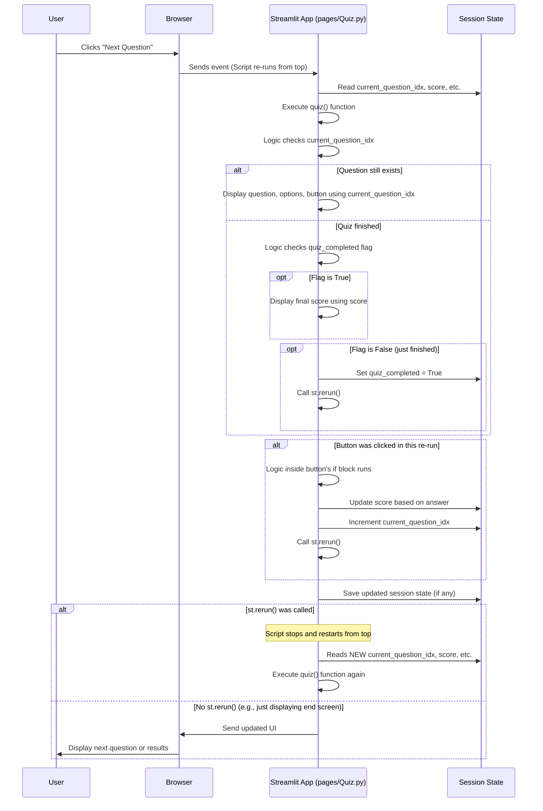

# Chapter 8: Interactive Quiz Logic

Welcome back to the Brainbrew tutorial! In our previous chapter, [Structured Output Handling](07_structured_output_handling_.md), we learned how Brainbrew uses powerful techniques like Pydantic and LangChain's `with_structured_output` to get quiz questions from the AI in a reliable, structured format – basically, a Python list where each item is a clear dictionary-like object containing the question text and its options with the correct answer marked.

Now that we have this list of questions, the challenge is to turn it into a dynamic, engaging, interactive quiz experience for the user. We don't just want to show the whole list at once! We need to:

1.  Show one question at a time.
2.  Allow the user to select an answer.
3.  Check if their answer is correct using the information from our structured data.
4.  Keep track of their score and progress.
5.  Move to the next question when they're ready.
6.  Show a summary of results at the end.

This is the role of the **Interactive Quiz Logic**. It's the part of the application that manages the state of the quiz (what question is current, what's the score) and uses Streamlit components to display the current question and handle user interactions.

## Why Interactive Logic is Needed

Imagine you have a stack of flashcards for studying. You look at the top card, think of the answer, check the back, maybe put it in a 'correct' or 'incorrect' pile, and then move to the next card. The Interactive Quiz Logic does something similar for our digital quiz. It handles showing *one* card (question) at a time, managing the piles (score, attempted questions), and moving through the stack.

Since Streamlit re-runs the script on every interaction (like clicking a button), this logic needs to be smart enough to remember where you are in the quiz and what your score is between those re-runs. As we learned in [Session State Management](03_session_state_management_.md), `st.session_state` is perfect for this!

## The Heart of the Quiz: The `quiz()` Function

Most of the Interactive Quiz Logic in Brainbrew lives within a single function named `quiz()` in the `pages/Quiz.py` file. This function is called whenever the `Quiz` page is displayed *and* there are questions available in `st.session_state`.

This function does everything: checks if the quiz is ongoing or finished, displays the current question or the final results, and sets up the interaction elements.

Let's look at the main structure of the `quiz()` function:

```python
# From pages/Quiz.py

# This function orchestrates the entire interactive quiz experience
def quiz():
    # 1. Get quiz data and state from session state
    questions = st.session_state.quiz_questions
    total_questions = len(questions)

    # 2. Display progress and stats
    st.progress(len(st.session_state.attempted_questions) / total_questions)
    st.write(
        f"Questions attempted: {len(st.session_state.attempted_questions)}/{total_questions}"
    )

    # 3. Check if quiz is NOT completed yet
    if not st.session_state.quiz_completed:
        # 4. Check if there are more questions
        if st.session_state.current_question_idx < total_questions:
            # 5. Display the current question and options
            current_question = questions[st.session_state.current_question_idx]
            st.markdown(f"### {current_question['question']}") # type: ignore

            # Display options using columns and radio button
            col1, col2 = st.columns(2)
            options = current_question["options"]
            option_items = list(options.keys())
            # ... (code to display options in columns) ...
            choice = st.radio("Select an option", ["A", "B", "C", "D"])

            # 6. Handle the "Next Question" button click
            if st.button("Next Question"):
                # 7. Process the user's answer, update score and state
                # ... (code to determine selected answer text) ...
                if options[answer]: # Check correctness using structured data
                    st.session_state.score += 1
                st.session_state.attempted_questions.add(st.session_state.current_question_idx)
                st.session_state.current_question_idx += 1
                st.rerun() # Trigger re-run to show next state

        # 8. Check if quiz just finished after the last question
        if st.session_state.current_question_idx >= total_questions:
            st.session_state.quiz_completed = True
            st.rerun() # Trigger re-run to show results screen

    # 9. If quiz is completed, display results
    if st.session_state.quiz_completed:
        st.header("Quiz Complete! 🎉", divider=True)
        # ... (code to display score and chart) ...

# ... (code outside the function to call quiz() if questions exist) ...
```

Let's break down the key parts.

## Remembering the Quiz State with `st.session_state`

The very first thing the `quiz()` function (and code that calls it) relies on is data stored in `st.session_state`. As discussed in [Session State Management](03_session_state_management_.md), these variables persist across re-runs:

*   `st.session_state.quiz_questions`: The list of questions generated by the AI ([Structured Output Handling](07_structured_output_handling_.md)). This list doesn't change during the quiz.
*   `st.session_state.current_question_idx`: An integer that tracks which question number we are currently displaying (starts at 0).
*   `st.session_state.score`: An integer that tracks how many questions the user has answered correctly (starts at 0).
*   `st.session_state.attempted_questions`: A set or list to keep track of which question *indices* have been attempted.
*   `st.session_state.quiz_completed`: A boolean flag (True/False) indicating if the user has finished all questions.

These are initialized (usually in `App.py`) before the quiz starts. The `quiz()` function reads these values at the beginning of each re-run to know what to display.

```python
# Inside the quiz() function:
questions = st.session_state.quiz_questions # Get the full list of questions
total_questions = len(questions)

# Accessing variables to know where we are and how we're doing
current_idx = st.session_state.current_question_idx
current_score = st.session_state.score
```
This simple retrieval of state variables is fundamental to continuing the quiz from where the user left off on the previous interaction.

## Displaying the Current Question

If the quiz is not yet completed (`if not st.session_state.quiz_completed:`) and there are more questions (`if st.session_state.current_question_idx < total_questions:`), the code proceeds to display the current question.

It gets the specific question data from the list using the current index:

```python
# Inside the quiz() function, when displaying a question:
current_question = questions[st.session_state.current_question_idx]
```
Thanks to [Structured Output Handling](07_structured_output_handling_.md), `current_question` is a dictionary-like object. We can easily access its parts:

```python
# Inside the quiz() function, displaying the question text:
st.markdown(f"### {current_question['question']}") # Accesses the question text

# Getting the options dictionary:
options = current_question["options"]
option_items = list(options.keys()) # Get a list of the option texts ("60 mph", "40 mph", etc.)

# Displaying options and the radio button for selection:
col1, col2 = st.columns(2)
with col1:
    # Display option text A and B
    st.container(border=True).markdown("A: " + option_items[0])
    st.container(border=True).markdown("B: " + option_items[1])
with col2:
    # Display option text C and D
    st.container(border=True).markdown("C: " + option_items[2])
    st.container(border=True).markdown("D: " + option_items[3])

choice = st.radio("Select an option", ["A", "B", "C", "D"]) # User selects A, B, C, or D
```
This code uses Streamlit's layout (`st.columns`, `st.container`) and input widgets (`st.radio`) to present the question and collect the user's answer choice.

## Handling the Answer and Moving On

The core interaction happens when the user clicks the "Next Question" button (`st.button("Next Question")`). The code inside the `if st.button(...):` block executes only when the button is clicked during a re-run.

```python
# Inside the quiz() function, inside the "Next Question" button's if block:

if choice: # Make sure an option was selected
    # Determine the actual text of the selected answer (e.g., "60 mph")
    answer = (
        option_items[0] if choice == "A"
        else option_items[1] if choice == "B"
        else option_items[2] if choice == "C"
        else option_items[3] if choice == "D"
        else None
    )

    # Check if the selected answer is correct using the options dictionary
    # 'options' is a dict like {"Option Text": True/False}
    if options[answer]:
        st.session_state.score += 1 # Increment score if correct

    # Mark the current question as attempted and move to the next index
    st.session_state.attempted_questions.add(st.session_state.current_question_idx)
    st.session_state.current_question_idx += 1

    st.rerun() # Tell Streamlit to re-run the script from the top!
```
This block performs the crucial logic:
1.  It figures out which answer text corresponds to the 'A', 'B', 'C', or 'D' the user selected.
2.  It looks up that answer text in the `options` dictionary (`options[answer]`). Remember from [Structured Output Handling](07_structured_output_handling_.md) that the value associated with each option text is `True` if it's the correct answer and `False` otherwise.
3.  It checks if that value is `True` and updates `st.session_state.score` if it is.
4.  It updates `st.session_state.attempted_questions` and increments `st.session_state.current_question_idx` to point to the *next* question.
5.  Finally, `st.rerun()` is called. **This is key!** It tells Streamlit, "Hey, something important changed (the quiz state!). Please stop the current execution and start the script from the beginning."

When the script re-runs, the `quiz()` function is called again. This time, it reads the *updated* `st.session_state.current_question_idx` and `st.session_state.score`, and proceeds to display the *next* question based on the new index.

## Checking for Quiz Completion and Displaying Results

The `quiz()` function also handles the end of the quiz.

After checking if there are more questions to display, there's a check to see if the `current_question_idx` has gone beyond the total number of questions:

```python
# Inside the quiz() function, after the question display logic:
# Check if quiz is complete (either after clicking the last 'Next' button or on re-run)
if st.session_state.current_question_idx >= total_questions:
    st.session_state.quiz_completed = True # Set the completion flag
    st.rerun() # Trigger re-run to display the end screen logic
```
If the index is past the last question, it sets the `st.session_state.quiz_completed` flag to `True` and calls `st.rerun()` again.

On this subsequent re-run, the `quiz()` function starts again. The first `if not st.session_state.quiz_completed:` check will now be `False`. Instead, the final `if st.session_state.quiz_completed:` block will be `True`, and the end screen is displayed:

```python
# Inside the quiz() function, displaying the end screen:
if st.session_state.quiz_completed:
    st.header("Quiz Complete! 🎉", divider=True)

    # Display the final score
    # (The code uses plotly, simplified here)
    st.write(f"You scored {st.session_state.score} out of {total_questions} questions right!")
    # ... (Plotly chart code using the final score) ...
```
This block accesses the final `st.session_state.score` and `st.session_state.total_questions` to show the user how they did.

## The Flow of Interaction

Here's a simplified sequence of how the Interactive Quiz Logic works across interactions:



This diagram shows how clicking the button triggers a re-run, the script updates the state in memory (`st.session_state`), calls `st.rerun()` to force another re-run, and then on that subsequent re-run, the `quiz()` function reads the *new* state and displays the appropriate content (the next question or the results).

## Conclusion

The **Interactive Quiz Logic** in Brainbrew is the core code that brings the quiz experience to life. We learned how it uses Streamlit's capabilities and leverages [Session State Management](03_session_state_management_.md) to keep track of the quiz's progress and the user's score across interactions.

By reading the structured quiz data (obtained via [Content Generation Pipelines](05_content_generation_pipelines__langchain_chains__.md) and [Structured Output Handling](07_structured_output_handling_.md)) from `st.session_state`, displaying questions and options using Streamlit components, capturing user input, checking answers against the structured data, updating state variables (score, current index), and using `st.rerun()` to refresh the display, the application guides the user step-by-step through the quiz until completion.

This chapter concludes our detailed look into the key concepts and abstractions behind Brainbrew. We've journeyed from the overall structure and user input, through managing application state and communicating with AI models, to crafting prompts, handling structured AI output, and finally building interactive features like the quiz.

---